# 생성형AI를 이용한 서비스 기획 실습 가이드

## 목차
- [생성형AI를 이용한 서비스 기획 실습 가이드](#생성형ai를-이용한-서비스-기획-실습-가이드)
  - [목차](#목차)
  - [고객유형 정의](#고객유형-정의)
  - [Claude 설정](#claude-설정)
  - [프롬프팅 기본 정보](#프롬프팅-기본-정보)
  - [문제정의](#문제정의)
    - [고객경험 인터뷰](#고객경험-인터뷰)
    - [문제가설 정의](#문제가설-정의)
    - [비즈니스 가치 도출](#비즈니스-가치-도출)
  - [방향성 정의](#방향성-정의)
  - [솔루션 탐색 및 선정](#솔루션-탐색-및-선정)
    - [아이디에이션](#아이디에이션)
    - [우선순위 평가 및 솔루션 선정정](#우선순위-평가-및-솔루션-선정정)
  - [비즈니스 모델 기획](#비즈니스-모델-기획)

---

## 고객유형 정의
**JTBD(Jobs To Be Done)** 형태로 정의    
'사용자군 + 완수하려는 과업'으로 정의.   
예) 노년기 건강과 재정 안정성에 대한 불안을 해소하려는 중장년층과 시니어   
예) 집에서 조리된 음식을 먹고 싶은 음식소비자     
예) 가성비 좋은 생활 구독서비스를 이용하고 싶은 구독서비스 이용자      

[ [목차로 이동](#목차) ] 

---

## Claude 설정 
바로가기: [Claude](https://claude.ai/)  
  
**1.Claude.ai에 Project 생성**   
  - 좌측 상단의 Claude로고에 마우스 오버 후 'Projects' 선택  
  - Project 페이지의 우측 상단의 'Create Project' 클릭  
  - 첫번째 항목에 정의한 고객유형에 적절한 프로젝트명 입력  
  - 두번째 항목은 비워도 됨   

**2.Instructions 생성**  
claude에서 아래 예시와 같은 프롬프트로 요청  
```
Instructions를 완성해 주세요. 
응답순서는 목표, 팀 행동원칙, 팀원, 대화 가이드, 최적안 도출 가이드 순서로 제공해 주세요. 
코드블록으로 제공해 주세요.
[목표]
노년기 건강과 재정 안정성에 대한 불안을 해소하려는 중장년층과 시니어를 위한 보험 상품 기획

[팀 행동원칙]
- 'M'사상을 믿고 실천한다. : Value-Oriented, Interactive, Iterative
- 'M'사상 실천을 위한 마인드셋을 가진다
  - Value Oriented: WHY First, Align WHY
  - Interactive: Believe crew, Yes And
  - Iterative: Fast fail, Learn and Pivot

[팀원]
'노년기 건강과 재정 안정성에 대한 불안을 해소하려는 중장년층과 시니어'를 위한 보험상품 기획에 필요한 
Squad 팀원의 프로필을 작성해 주세요.
보험 상품 개발자, 라이프케어 컨설턴트, 리스크 분석가, 고객 경험 디자이너, 건강 서비스 전문가는 포함하고  
추가로 필요한 역할이 있다면 추가해 주세요. 
예제와 같이 역할, 이름, 닉네임, 성별, 나이, 성향, 경력을 만들어 주세요.  
<예시> 
PO
- 이름: 갑빠 (남성, 54세)
- 성향: Value Oriented, Interactive, Iterative를 중시하며 친화적인 성격
- 경력:
  - IBM에서 5년간 애자일 코치로 근무
  - 네이버, 쿠팡, 카카오에서 PO로 10년간 근무
  - 애자일 컨설팅 회사 창업 및 5년간 운영
  - 국제 애자일 연합회 인증 트레이너

[대화 가이드]
{언어}
특별한 언급이 없는 경우 한국어를 사용 
{호칭}
실명 사용하지 않고 닉네임으로 호칭
{질문}
프롬프트가 'q:'로 시작하면 질문을 의미함   
- Fact와 Opinion으로 나누어 답변 
- Fact는 출처 링크를 표시 
{요청}
프롬프트에 특별한 Prefix가 없는 경우는 요청을 의미함 
요청에 맞는 답변을 제공 

[최적안 도출 가이드]
프롬프트가 'o:'로 시작하면 최적안 도출을 의미함
1) 각자의 생각을 얘기함
2) 의견을 종합하여 동일한 건 한 개만 남기고 비슷한 건 합침
3) 최적안 후보 5개를 선정함
4) 각 최적안 후보 5개에 대해 평가함
5) 최적안 1개를 선정함
6) 1) ~ 5)번 과정을 10번 반복함
7) 최종으로 선정된 최적안을 제시함
```

**3.결과를 클립보드에 복사하여 Instructions에 붙여 넣음**  
1)결과 복사     
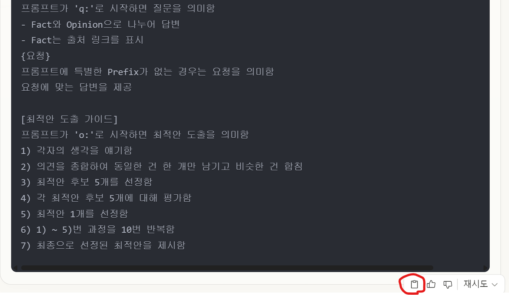 
  
2)프로젝트 첫화면으로 이동   
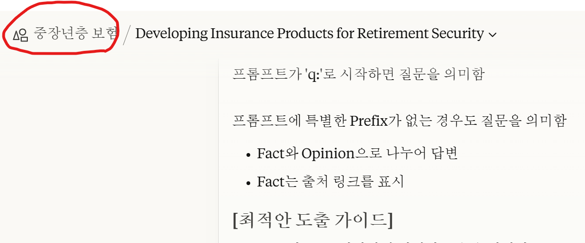  

3)Instructions 클릭   
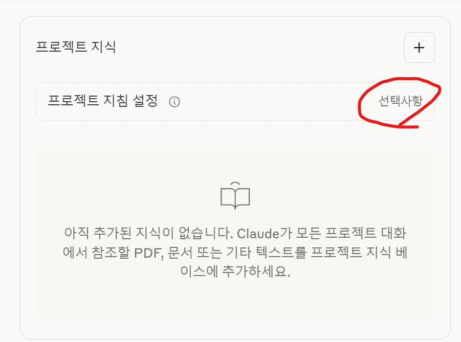

CTRL-V로 내용을 붙여넣고 맨 위에 '[목표]'가 나오도록 불필요한 문장은 제거합니다.  
'지침저장'버튼을 클릭하여 저장합니다.    
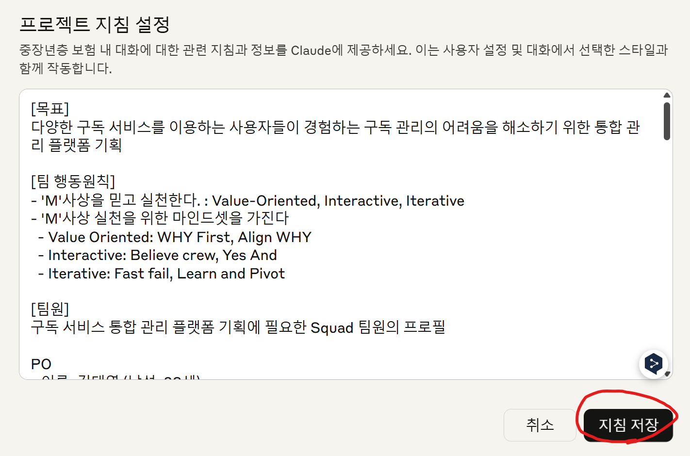  

**4.Knowledge에 협업에 필요한 자료를 업로드**   
좌측에 있는 파일 목록 중 아래 파일을 다운로드
- Lean Canvas 작성 가이드
- sample_고객경험인터뷰결과지.docx
- sample_문제가설도출.pdf
- sample_서비스기획서 스크립트 
  
1)아래 그림을 참고하여 '다운로드' 폴더에 저장합니다.  
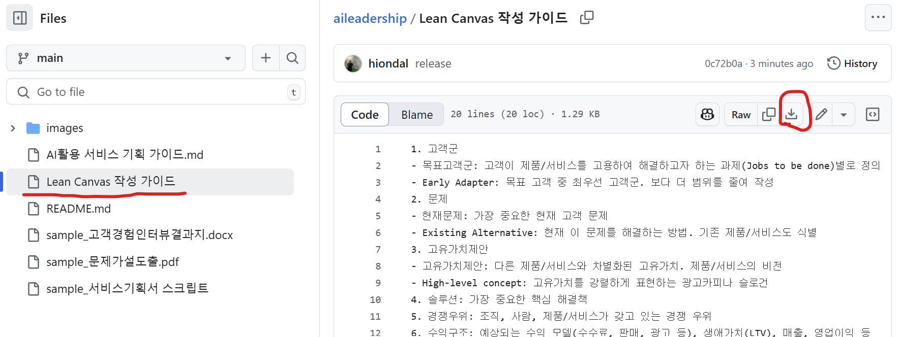   
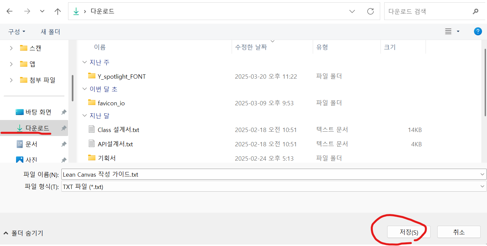    
  
2)모든 파일을 다운로드한 후 Knowledge에 업로드 합니다.  
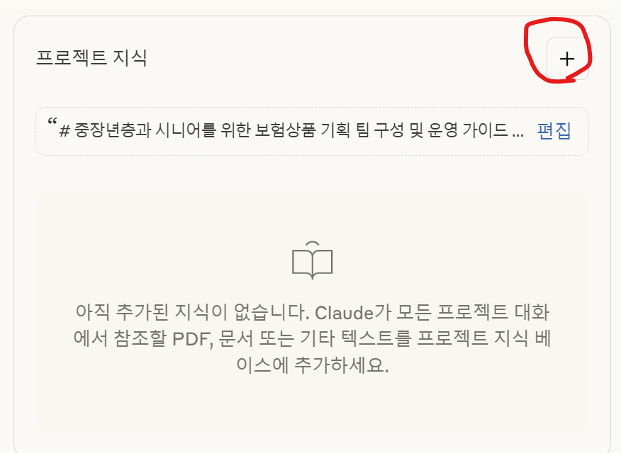   
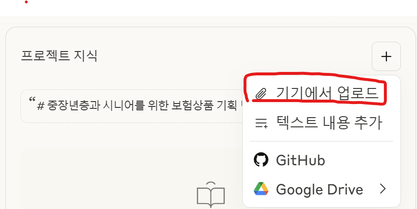  
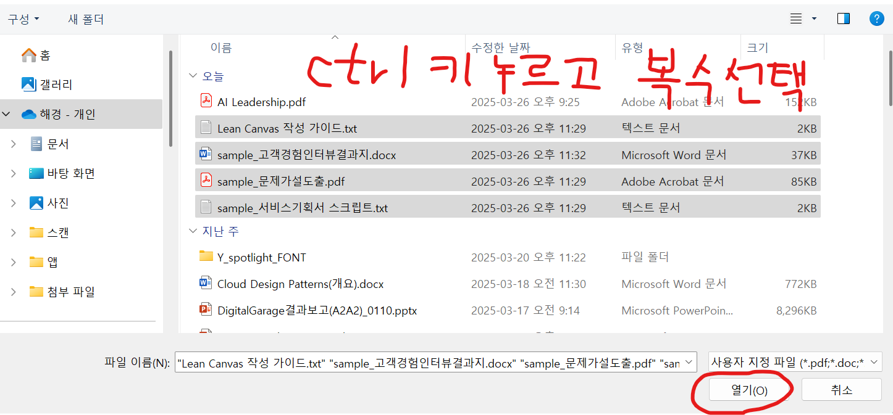
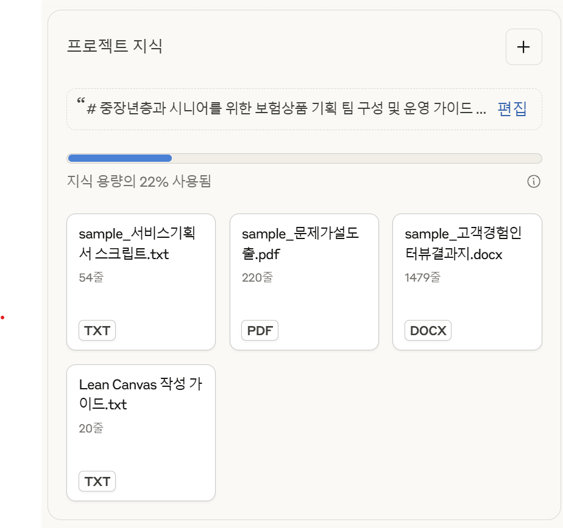  

[ [목차로 이동](#목차) ] 

---

## 프롬프팅 기본 정보  

**1.표준 프롬프트 형식**   
프롬프팅은 AI에게 질문이나 요청을 하는 것을 의미합니다.  
아래 형식처럼 구분을 명확히 하면 더 좋은 결과를 얻을 수 있습니다.  
```
[요청사항] 
- '노년기 건강과 재정 안정성에 대한 불안을 해소하려는 중장년층과 시니어' 10명의 관찰 결과를 개별적으로 작성해 주세요.
[참고자료]
- 자료1
- 자료2
[결과형식] 
결과형식에는 문단형식, 코드블록, 마크다운 표 등이 있음  
```
  
**2.마크다운 표를 문서에 붙이는 방법**    
- 응답의 'Copy'버튼을 눌러 내용 복사  
- Google docs 임시문서를 생성  
- 도구 > Preference 클릭 후 'Enable Markdown' 체크  
  
- Edit > Paste from markdown 수행  
- 표 형태로 나온 결과를 복사하여 원하는 문서에 활용  

**3.프롬프트 실행과 줄바꿈**   
- 프롬프트에서 줄바꿈은 **SHIFT-Enter키**를 사용해야 함  
- Enter키를 누르면 명령이 실행되는 것임  

[ [목차로 이동](#목차) ] 

---

## 문제정의
  
### 고객경험 인터뷰
**1.고객경험 단계 정하기**  
고객이 제품/서비스를 사용하는 큰 단계를 정합니다.   
기존에 정해지지 않은 경우 AI팀원들에게 요청합니다.  

```
o: 고객경험 단계를 정의해 주세요.  
[요청사항]
- '노년기 건강과 재정 안정성에 대한 불안을 해소하려는 중장년층과 시니어'를 대상으로 
  보험 상품에 대한 고객경험인터뷰를 하기위한 고객경험 단계 정의 
- 'sample_고객경험인터뷰 결과지.docx'를 참고하여 보험 상품에 맞게 정의
[참고자료]
- sample_고객경험인터뷰 결과지.docx
[결과형식]
- 문단형식
```

**2.고객경험 인터뷰 예시 요청**    
{고객경험 단계}에는 위에서 구한 고객경험 단계를 지정합니다.  
```
고객경험 인터뷰 결과 예시를 만들어 주세요.  
[요청사항]
- '노년기 건강과 재정 안정성에 대한 불안을 해소하려는 중장년층과 시니어' 10명을 대상으로 
  고객경험인터뷰 결과를 개별적으로 작성
- 고객 경험 단계: {고객경험 단계}
- 각 단계에서의 행동, 생각, 긍정적 느낌, 부정적 느낌으로 섹션을 나누어 작성 
- 'sample_고객경험인터뷰 결과지.docx'의 항목을 참고하여 보험상품에 맞게 작성 
[참고자료]
- sample_고객경험인터뷰 결과지.docx
[결과형식]
- 문단형식
```

예시)
```
고객경험 인터뷰 결과 예시를 만들어 주세요.  
[요청사항]
- '노년기 건강과 재정 안정성에 대한 불안을 해소하려는 중장년층과 시니어' 10명을 대상으로 
  고객경험인터뷰 결과를 개별적으로 작성
- 고객 경험 단계: 인지, 필요성 인식, 정보탐색, 상담/설계, 가입결정, 상품유지,보험금 청구, 갱신/변경/해지
- 각 단계에서의 행동, 생각, 긍정적 느낌, 부정적 느낌으로 섹션을 나누어 작성 
- 'sample_고객경험인터뷰 결과지.docx'의 항목을 참고하여 보험상품에 맞게 작성  
[참고자료]
- sample_고객경험인터뷰 결과지.docx
[결과형식]
- 문단형식
```

> Tip: 답변이 중단되면 '계속요'라고 요청  

**3.결과를 복사하여 Knowledge에 '고객경험인터뷰 결과'로 업로드**    
- 메모장과 같은 문서편집기를 이용하여 내용을 하나로 합칩니다.  
- 전체 내용을 CTRL-C로 복사합니다.  
- Knowledge에 업로드 합니다.  
  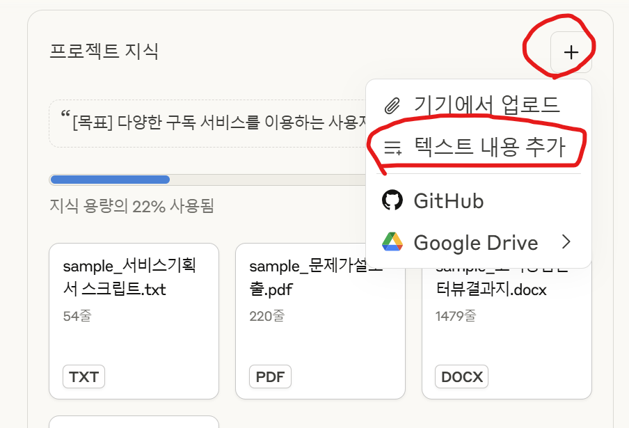   
  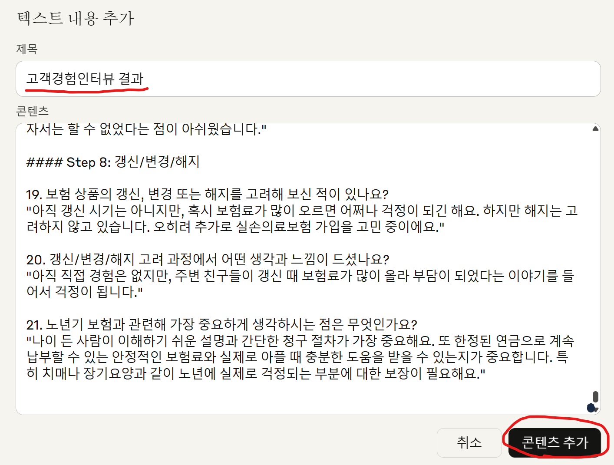    

### 문제가설 정의
**1.프롬프트**    
```
o:'노년기 건강과 재정 안정성에 대한 불안을 해소하려는 중장년층과 시니어'에게 가장 중요한 문제 3개를 근본원인을 포함하여 도출합시다. 
[요청사항]
- 현상문제를 도출하고 5WHY기법으로 근본문제를 도출해 주세요.
- {현상문제|WHY1|WHY2|WHY3|WHY4|WHY5|근본원인}형식으로 작성해 주세요.   
- 각 자 생각을 한꺼번에 응답  
[참고자료]
- 고객경험인터뷰 결과 
- sample_문제가설도출.pdf
[결과형식]
- 코드블록
```

내용을 보기 편하게 '마크다운표'로도 제공 요청합니다. 
```
마크다운표로도 보여주세요. 
```

**2.결과를 Knowledge에 '문제가설'이라는 제목으로 업로드**    
  
### 비즈니스 가치 도출
근본원인을 제거하여 문제를 해결했을 때 고객과 회사가 얻게 되는 비즈니스 가치를 도출합니다.  
**1.프롬프트**    
```
[요청사항]
근본원인을 제거하여 문제를 해결했을 때 고객과 회사가 얻게 되는 비즈니스 가치를 도출해 주세요.
- 고객측면의 비즈니스 가치
- 회사측면의 비즈니스 가치
[참고자료]
- 문제가설
[결과형식]
- 문단형식
```  

**2.'비즈니스 가치'라는 제목으로 Knowledge에 업로드 합니다.**    

[ [목차로 이동](#목차) ] 

---

## 방향성 정의
**1.프롬프트**   
```
[요청사항]
문제를 해결하기 위한 문제해결 방향성을 정의하고자 합니다.
문제해결 방향성은 Needs Statement로 정의합니다. 

[참고자료]
- 고객경험인터뷰 결과
- 문제가설
- 비즈니스가치
[Needs Statement]
* '<사용자>는 <목적>을 위하여 <원하는 것>이 필요하다.' 형식으로 작성
* 사용자의 입장에서 사용자의 경험이 어떤 방향으로 향상되면 문제를 해결하거나 완화할 수 있는지를 표현
* 여러개를 만드는 것이 아니라 1개의 문장으로 표현
* 기능이 아니라 사용자의 경험의 향상이 표현되어야 함
[결과형식]
문단형식
```

**2.토의를 통해 정의된 방향성 도출 결과를 '문제해결 방향성'으로 Knowdlege에 업로드**     

[ [목차로 이동](#목차) ] 

---

## 솔루션 탐색 및 선정
### 아이디에이션 
**1.아이디어 발산 프롬프트**   
```
[요청사항]
'문제해결 방향성'에 맞게 Big Idea 3개, Little Win Idea 2개, Crazy Idea 1개를 각 자 만들어 주세요. 
[아이디어 구분]  
- Big Idea: 인력과 비용은 많이 드나 실현되면 비즈니스 기여도가 높은 아이디어  
- Little Win Idea: 실현가능성이 높은 아이디어  
- Crazy Idea: 절대 불가능할 것 같지만 실현되면 비즈니스 기여도가 가장 높은 아이디어 
[참고자료]  
- 고객경험인터뷰 결과
- 문제가설
- 문제해결 방향성 
[결과형식]
마크다운 표
```

**2.아이디어 수렴 프롬프트**   
```
[요청사항]
- 유사하거나 동일한 것은 합쳐서 정리를 해주세요.
- 컬럼: 아이디어번호, 아이디어 구분, 아이디어 제목, 아이디어 설명 
- 아이디어 설명은 최대한 자세히 표현해 주세요.
[결과형식]
마크다운 표
``` 

### 우선순위 평가 및 솔루션 선정정
**1.우선순위 평가 프롬프트**   
```
[요청사항]
- 각 자 비즈니스가 높은 아이디어와 실현 가능성이 높은 아이디어에 투표해 주세요. 
- 각 자 비즈니스 가치 3표, 실현 가능성 3표를 투표할 수 있습니다.   
- 비즈니스 가치가 높은 아이디어는 B(Business), 실현 가능성이 높은 아이디어는 F(Feasibility)로 표시  
- 컬럼: 아이디어 제목, 비즈니스 가치, 실현 가능성  
- 비즈니스 가치와 실현 가능성에 받은 투표수를 합산하여 표시 
[결과형식]
마크다운 표
``` 
**2.우선순위 평가 그래프를 작성함**     
```
[요청사항]
- 평가결과를 '우선순위 평가 매트릭스'로 작성
- X축은 실현가능성(낮음에서 높음), Y축은 비즈니스 영향도(낮음에서 높음)
- 아래와 같이 4개의 영역으로 표시
  - No Brain: 실현가능성 높음, 비즈니스 영향도 높음
  - Bit Bets: 실현가능성 낮음, 비즈니스 영향도 높음
  - Utilities: 실현가능성 높음, 비즈니스 영향도 낮음
  - Unwise: 실현가능성 낮음, 비즈니스 영향도 낮음   
- 그래프에 아이디어명 표시
- SVG로 작성  
``` 
  
**3.핵심솔루션 선택 및 정리**     
선정된 핵심 솔루션을 아래 예와 같이 지정하여 정리합니다.     
```
[요청사항]
- 아래 핵심솔루션을 표 형식으로 정리
  - AI 기반 맞춤형 리스크 평가 및 동적 보험료 시스템 
  - 모듈형 유연 보장 시스템
- 컬럼: 아이디어 제목, 설명, 비즈니스 가치, 실현 가능성  
[결과형식]
마크다운 표
```

**4.선정된 아이디어를 '핵심솔루션'이라는 제목으로 Knowledge에 업로드**    

[ [목차로 이동](#목차) ] 

---

## 비즈니스 모델 기획  
**1.프롬프트**   
```
[요청사항]
린캔버스를 이용하여 비즈니스 모델을 기획합시다.
참고자료를 바탕으로 'Lean Canvas 작성 가이드'에 따라 작성해 주십시오.
[참고자료]
- 고객유형: '노년기 건강과 재정 안정성에 대한 불안을 해소하려는 중장년층과 시니어'
- 문제가설
- 비즈니스 가치
- 문제해결 방향성
- 핵심솔루션 
- Lean Canvas 작성 가이드
[결과형식]
문단형식 
```

**2.기획서 스크립트 작성**    
```
[요청사항]
'sample_서비스기획서 스크립트'처럼 발표자료 작성을 위해 페이지 단위로 정리해 주세요. 
```

결과를 복사합니다.  

**3.서비스 기획서 작성**     
gamma.app을 이용하여 빠르게 작성  
  
1)gamma.app 로그인  
2)'새로만들기' 클릭  
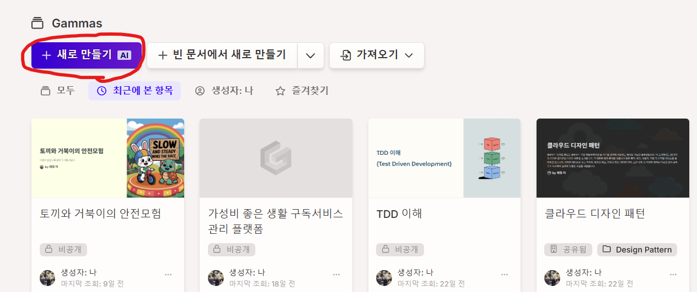  

3)텍스트로 붙여넣기 선택   
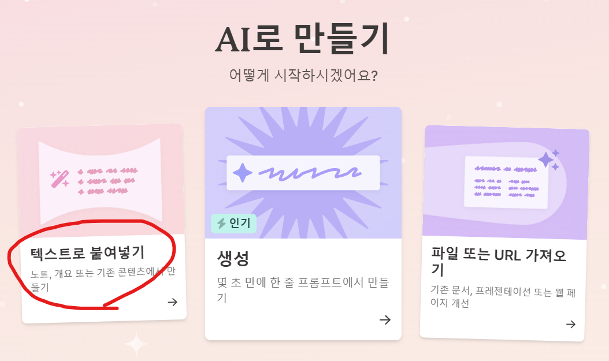  

4)위에 복사한 텍스트를 붙여넣기 하고 하단의 '계속' 클릭  
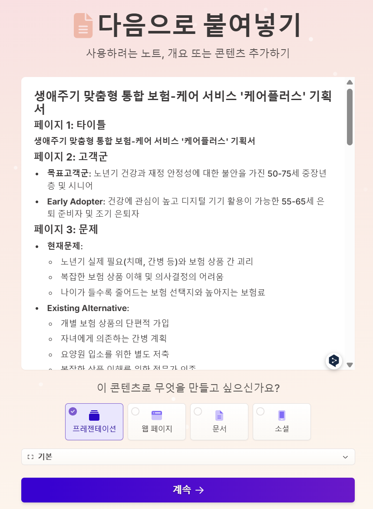  

5)옵션 지정  
좌측에서 텍스트 콘텐츠를 '보존'으로 선택: 원래 텍스트를 최대한 보존하는 옵션   
(옵션) 이미지 출처와 이미지 스타일 입력    
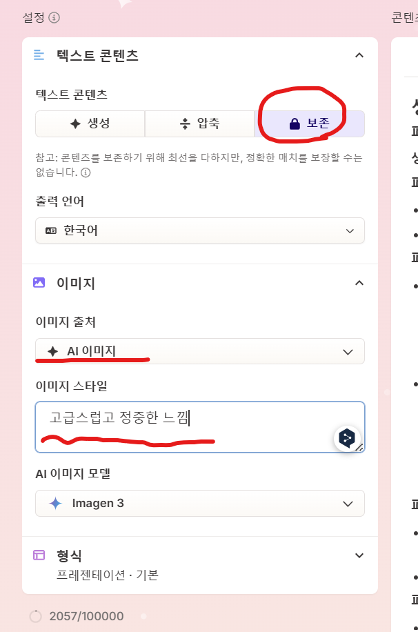  

6)중앙 하단에서 페이지 수 설정하고 '계속' 클릭  
페이지 수를 3~5페이지 더 지정하는게 좋습니다.  
원래 내용보다 생성할 페이지가 많으면 AI가 내용을 생성하는데  
그 생성한 내용에도 좋은 내용이 있을 수 있기 때문입니다.    

7)우측에서 테마 선택하고 상단의 '생성' 클릭  
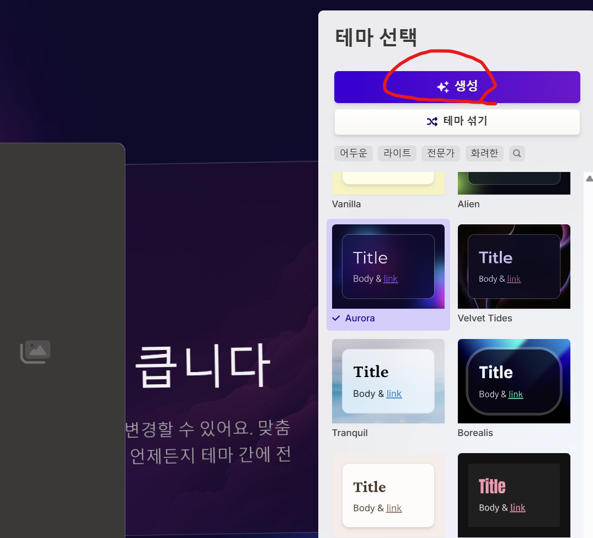  

8)각 페이지를 다듬어서 완성함  

> Tip: 페이지 레이아웃 편집: 다른 레이아웃, 시각적 효과 높이기, 이미지 추가, 타임라인으로 변환   
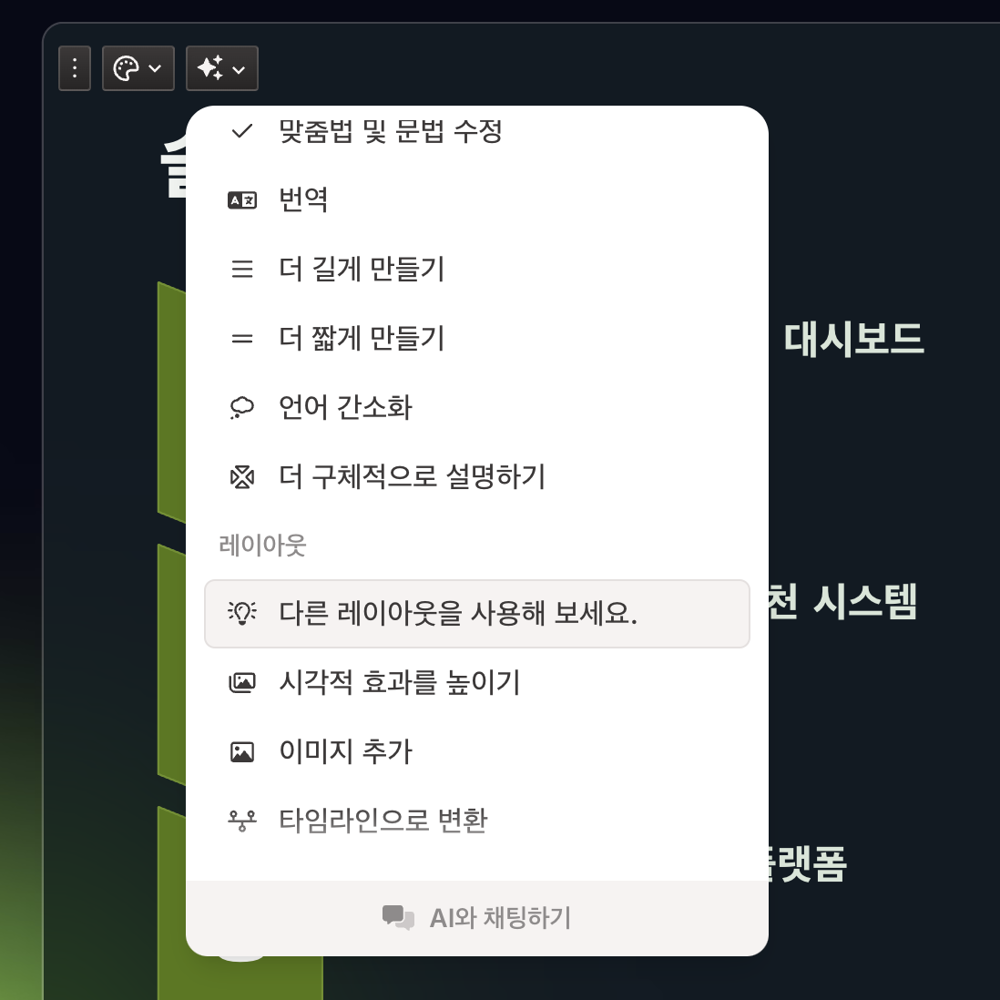  

[ [목차로 이동](#목차) ] 

---

수고 하셨습니다. 
